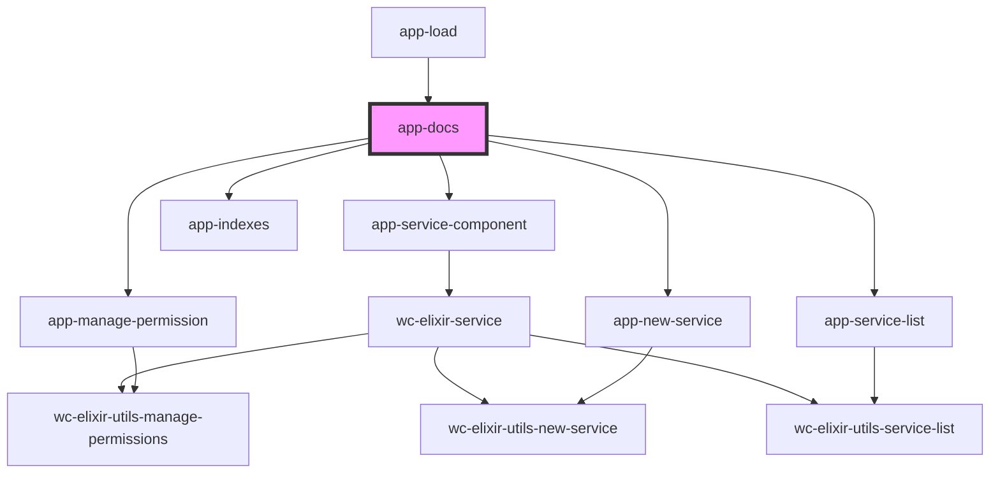

# wc-docs

<!-- Auto Generated Below -->

## Dependencies

### Used by

 - [app-load](../app-load)

### Depends on

- [app-service-component](../app-service-component)
- [app-service-list](../app-service-list)
- [app-manage-permission](../app-manage-permission)
- [app-new-service](../app-new-service)
- [app-indexes](../app-indexes)

### Graph

----------------------------------------------

*Built with [StencilJS](https://stenciljs.com/)*
