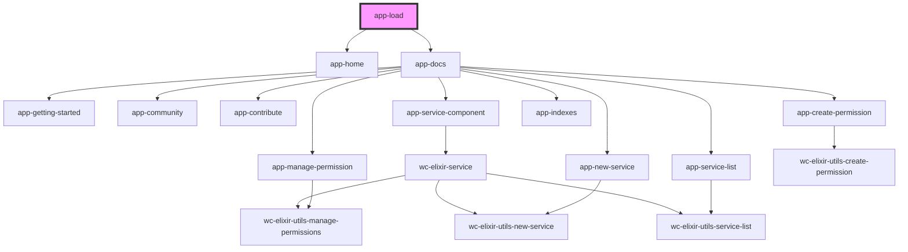

# app-load

<!-- Auto Generated Below -->

## Dependencies

### Depends on

- [app-home](../app-home)
- [app-docs](../app-docs)

### Graph

----------------------------------------------

*Built with [StencilJS](https://stenciljs.com/)*
