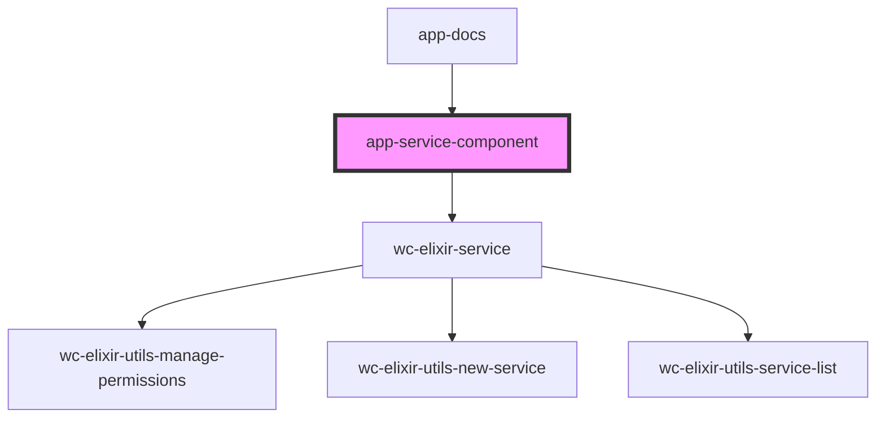

# app-service-component

<!-- Auto Generated Below -->

## Dependencies

### Used by

 - [app-docs](../app-docs)

### Depends on

- [wc-elixir-service](../wc-elixir-service)

### Graph

----------------------------------------------

*Built with [StencilJS](https://stenciljs.com/)*
