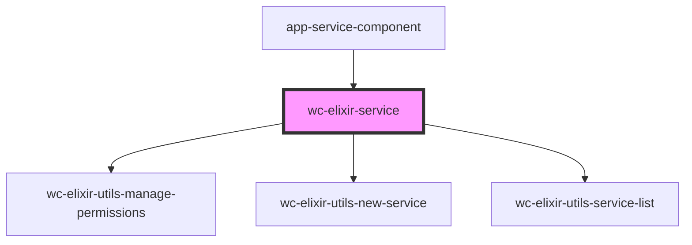

# wc-elixir-service

<!-- Auto Generated Below -->

## Dependencies

### Used by

 - [app-service-component](../app-service-component)

### Depends on

- [wc-elixir-utils-manage-permissions](../wc-elixir-utils-manage-permissions)
- [wc-elixir-utils-new-service](../wc-elixir-utils-new-service)
- [wc-elixir-utils-service-list](../wc-elixir-utils-service-list)

### Graph

----------------------------------------------

*Built with [StencilJS](https://stenciljs.com/)*
