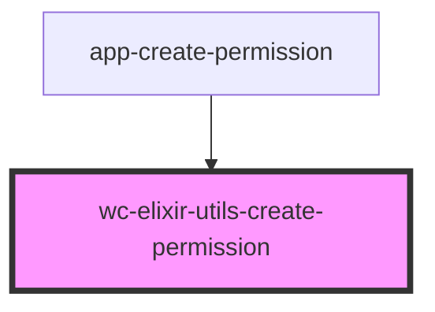

# wc-elixir-utils-create-permission

<!-- Auto Generated Below -->

## Dependencies

### Used by

 - [app-create-permission](../app-create-permission)

### Graph

----------------------------------------------

*Built with [StencilJS](https://stenciljs.com/)*
