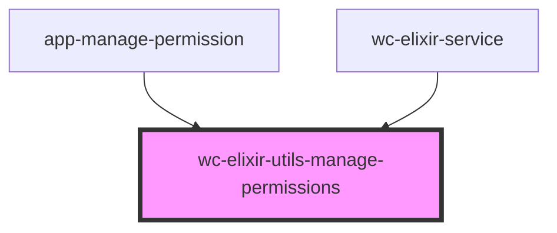

# wc-elixir-utils-manage-permissions

<!-- Auto Generated Below -->

## Properties

| Property       | Attribute        | Description | Type     | Default     |
| -------------- | ---------------- | ----------- | -------- | ----------- |
| `authToken`    | `auth-token`     |             | `string` | `undefined` |
| `itemsPerPage` | `items-per-page` |             | `number` | `5`         |

## Dependencies

### Used by

 - [app-manage-permission](../app-manage-permission)
 - [wc-elixir-service](../wc-elixir-service)

### Graph

----------------------------------------------

*Built with [StencilJS](https://stenciljs.com/)*
