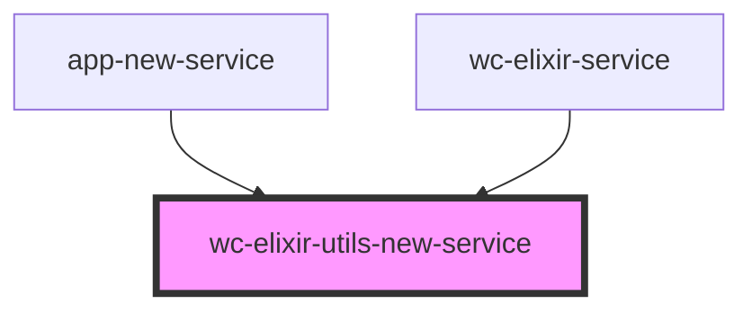

# wc-elixir-utils-new-service

<!-- Auto Generated Below -->

## Properties

| Property    | Attribute    | Description | Type     | Default     |
| ----------- | ------------ | ----------- | -------- | ----------- |
| `apiUrl`    | `api-url`    |             | `string` | `undefined` |
| `authToken` | `auth-token` |             | `string` | `undefined` |
| `schema`    | `schema`     |             | `string` | `undefined` |

## Dependencies

### Used by

 - [app-new-service](../app-new-service)
 - [wc-elixir-service](../wc-elixir-service)

### Graph

----------------------------------------------

*Built with [StencilJS](https://stenciljs.com/)*
