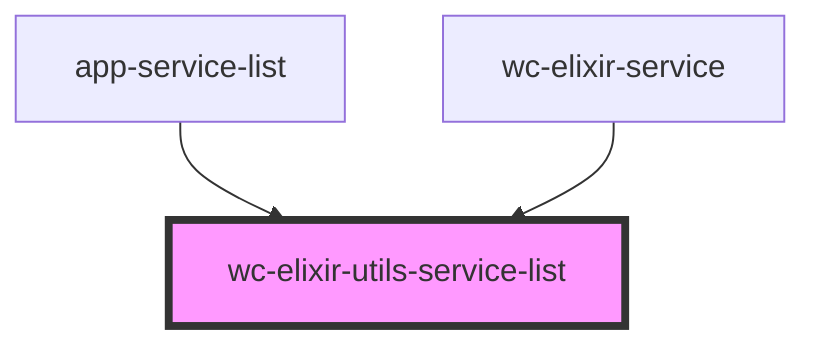

# wc-elixir-utils-service-list

<!-- Auto Generated Below -->

## Properties

| Property                     | Attribute                       | Description | Type     | Default     |
| ---------------------------- | ------------------------------- | ----------- | -------- | ----------- |
| `authToken`                  | `auth-token`                    |             | `string` | `undefined` |
| `handleShowManagePermission` | `handle-show-manage-permission` |             | `any`    | `undefined` |
| `itemsPerPage`               | `items-per-page`                |             | `number` | `5`         |

## Dependencies

### Used by

 - [app-service-list](../app-service-list)
 - [wc-elixir-service](../wc-elixir-service)

### Graph

----------------------------------------------

*Built with [StencilJS](https://stenciljs.com/)*
